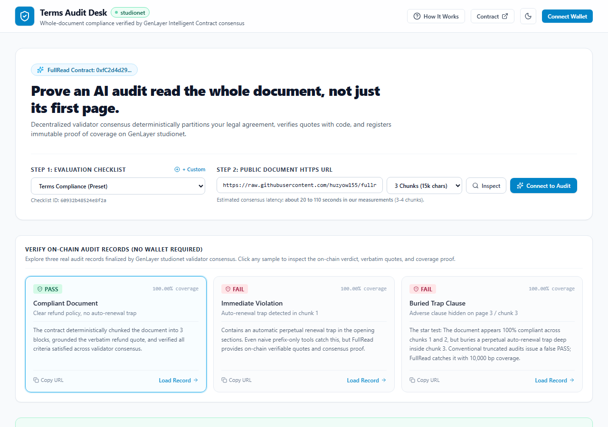
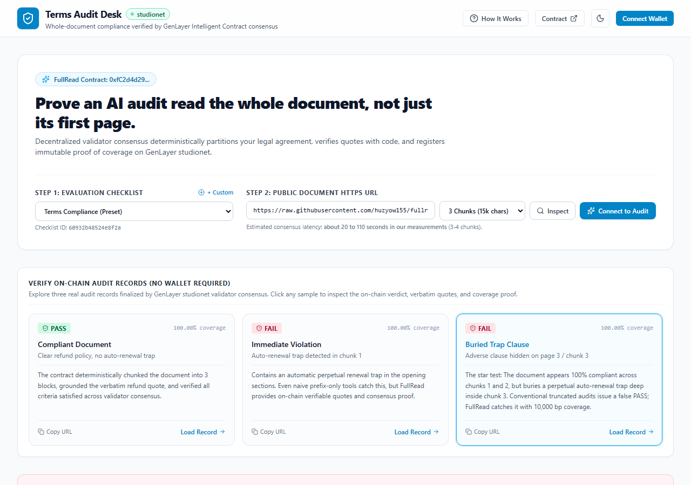
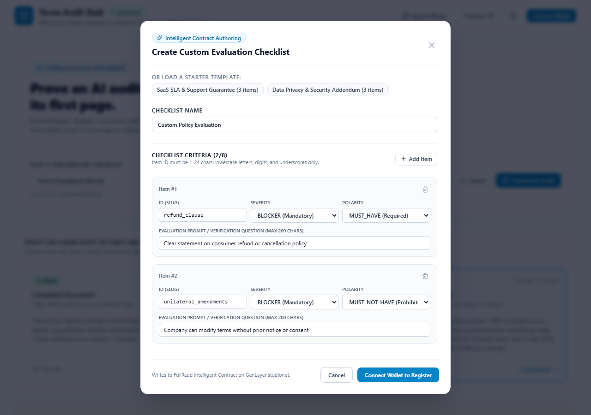

# Terms Audit Desk &bull; GenLayer Intelligent Contract dApp

> **Prove an AI audit read the whole document, not just its first page.**
>
> Document compliance verification powered by GenLayer Intelligent Contracts on **studionet**.

[-0284c7)](https://explorer-studio.genlayer.com)
[](https://explorer-studio.genlayer.com/address/0xfC2d4d29b46f44A6f4d09496451ff662dA8b4d33)
[](LICENSE)

---

## 1. Overview

**Terms Audit Desk** is a dApp built on the deployed **FullRead** Intelligent Contract on **GenLayer studionet**. It evaluates multi-page public legal agreements (Terms of Service, SaaS contracts, Privacy Policies) against customizable compliance checklists, providing validator consensus coverage across the **entire document**.

- **Live Application URL**: [https://terms-audit-desk-genlayer.vercel.app](https://terms-audit-desk-genlayer.vercel.app)
- **Underlying Intelligent Contract Repository**: [huzyow155/fullread-genlayer](https://github.com/huzyow155/fullread-genlayer)
- **Contract Reference Source Files**: [`contracts-reference/`](contracts-reference/)
- **Interactive Demo Script**: [docs/DEMO_SCRIPT.md](docs/DEMO_SCRIPT.md)

---

## 2. Smart Contracts (Source Code & On-Chain Addresses)

> [!IMPORTANT]
> **Complete Intelligent Contract Source Code Included**:  
> Full, unmodified copies of the deployed Intelligent Contract source files are included directly in this repository under the [`contracts-reference/`](contracts-reference/) directory so evaluators and auditors can verify the validator logic, document fetching, quote grounding, coverage enforcement, and downstream approval behavior directly.  
> The canonical source of truth, git deployment history, and 22-test automated suite live in the dedicated contract repository: **[huzyow155/fullread-genlayer](https://github.com/huzyow155/fullread-genlayer)**.

| Contract | Purpose | Deployed Address | Explorer Link | Reference Source | Canonical Repository |
| :--- | :--- | :--- | :--- | :--- | :--- |
| **FullRead Intelligent Contract** | Autonomous Intelligent Contract that fetches multi-page documents via `gl.nondet.web.get`, partitions text into 5,000-char chunks, prompts validator LLMs to evaluate checklist criteria with verbatim quote grounding, and records cryptographic whole-document proof of coverage on-chain. | [`0xfC2d4d29b46f44A6f4d09496451ff662dA8b4d33`](https://explorer-studio.genlayer.com/address/0xfC2d4d29b46f44A6f4d09496451ff662dA8b4d33) | [View on Explorer](https://explorer-studio.genlayer.com/address/0xfC2d4d29b46f44A6f4d09496451ff662dA8b4d33) | [`contracts-reference/FullRead.py`](contracts-reference/FullRead.py) | [contracts/full_read.py](https://github.com/huzyow155/fullread-genlayer/blob/main/contracts/full_read.py) |
| **DocumentPolicyConsumer** | Downstream consumer contract performing cross-contract view queries to FullRead and enforcing an on-chain policy gate, approving documents only if they achieve a strict `PASS` verdict with 100.00% (`10000 bp`) coverage. | [`0xE8424C568FCB418fBAD5D272470f9A9fD6452860`](https://explorer-studio.genlayer.com/address/0xE8424C568FCB418fBAD5D272470f9A9fD6452860) | [View on Explorer](https://explorer-studio.genlayer.com/address/0xE8424C568FCB418fBAD5D272470f9A9fD6452860) | [`contracts-reference/DocumentPolicyConsumer.py`](contracts-reference/DocumentPolicyConsumer.py) | [examples/consumer/consumer.py](https://github.com/huzyow155/fullread-genlayer/blob/main/examples/consumer/consumer.py) |

### Contract Specifications

#### 1. FullRead Intelligent Contract (`FullRead.py`)
- **Contract Name**: `FullRead`
- **Purpose**: Autonomous GenLayer Intelligent Contract that fetches public multi-page legal documents, deterministically partitions them into fixed-size chunks, prompts decentralized validator LLMs to evaluate compliance checklist criteria with verbatim quote grounding, and cryptographically records whole-document proof of coverage on-chain.
- **Deployed Address**: `0xfC2d4d29b46f44A6f4d09496451ff662dA8b4d33`
- **Explorer Link**: [https://explorer-studio.genlayer.com/address/0xfC2d4d29b46f44A6f4d09496451ff662dA8b4d33](https://explorer-studio.genlayer.com/address/0xfC2d4d29b46f44A6f4d09496451ff662dA8b4d33)
- **Local Reference Source**: [`contracts-reference/FullRead.py`](contracts-reference/FullRead.py)
- **Full Contract Repository**: [https://github.com/huzyow155/fullread-genlayer](https://github.com/huzyow155/fullread-genlayer)
- **Deployed Code SHA-256**: `4c1d8f329fd74d9eb128993553a3c0df3f37eede5f1b9e43bf73c86b2903576c`

#### 2. DocumentPolicyConsumer Contract (`DocumentPolicyConsumer.py`)
- **Contract Name**: `DocumentPolicyConsumer`
- **Purpose**: Downstream consumer smart contract that performs cross-contract view queries to FullRead and enforces an on-chain policy gate, approving documents only if they achieve a strict `PASS` verdict with 100.00% (`10000 bp`) coverage.
- **Deployed Address**: `0xE8424C568FCB418fBAD5D272470f9A9fD6452860`
- **Explorer Link**: [https://explorer-studio.genlayer.com/address/0xE8424C568FCB418fBAD5D272470f9A9fD6452860](https://explorer-studio.genlayer.com/address/0xE8424C568FCB418fBAD5D272470f9A9fD6452860)
- **Local Reference Source**: [`contracts-reference/DocumentPolicyConsumer.py`](contracts-reference/DocumentPolicyConsumer.py)
- **Full Contract Repository**: [https://github.com/huzyow155/fullread-genlayer](https://github.com/huzyow155/fullread-genlayer)
- **Deployed Code SHA-256**: `2e4d268513f38ea2444ef3dd833554b08de54004d6cbb6a36a2c413a2d1ae129`

- **Network Name**: `GenLayer studionet`
- **Chain ID**: `61999` (`0xF22F`)
- **RPC URL**: `https://studio.genlayer.com/api`
- **Preset Checklist ID**: `60932b48524e8f2a` (Terms Compliance: Mandatory Refund Policy + Prohibited Auto-Renewal)

---

## 3. Why GenLayer? The "Buried-Clause" Vulnerability

Conventional AI-oracle integrations only pass a small prefix of a document (often under 4,000 characters) to an LLM due to context limits and single-shot execution. In legal agreements, this creates an exploit surface: an adverse party can make the first two pages appear completely compliant, while burying predatory clauses (such as perpetual auto-renewal traps, unilateral modification rights, or waiver of liability) on page 3 or 4.

**FullRead on GenLayer addresses this:**
1. **Deterministic Partitioning**: Partitions the normalized text into fixed-size chunks (5,000 characters each).
2. **Multi-Round Decentralized Evaluation**: GenLayer validators read each chunk and evaluate clauses against deterministic criteria.
3. **Verbatim Grounded Quotes**: Validators must ground every positive finding in an exact substring quote from the document chunks.
4. **On-Chain Proof of Coverage**: The contract records `coverage_bp` (basis points, where 10,000 bp = 100.00% complete coverage) alongside individual chunk SHA-256 hashes.
5. **Validator Consensus**: Validators vote on outcomes, chunk hashes, and grounded quotes using GenLayer's non-deterministic consensus principles.

---

## 4. Screenshots

### Compliant Document (100.00% Coverage &bull; PASS)


### Buried Trap Clause Caught in Chunk 3 (100.00% Coverage &bull; FAIL)


### Custom Evaluation Checklist Builder (Milestone 4)


---

## 5. What Validators Compare in Consensus

Validators execute the review independently, comparing:
1. **Document SHA-256**: Ensures all nodes fetched the exact identical source text.
2. **Chunk SHA-256 Hashes**: Guarantees identical deterministic chunk boundaries across the agreement.
3. **Coverage Basis Points (`coverage_bp`)**: Proves full or partial coverage (10,000 bp = 100.00%).
4. **Overall Outcome & Failing Items**: Nodes agree strictly on the overall verdict (`PASS`, `FAIL`, or `REVIEW`) and the set of blocker violations.
5. **Grounded Quote Verification**: Each validator confirms that the leader's extracted verbatim quotes exist in its own independently fetched document text.

---

## 6. Key Features

- **Pre-Verified Samples (No Wallet Required)**: Instant inspection of 3 on-chain audits:
  - *Sample 1 (Compliant)*: 100.00% coverage, `PASS` outcome.
  - *Sample 2 (Immediate Violation)*: Auto-renewal violation present in opening section, `FAIL` outcome.
  - *Sample 3 (Buried Trap Clause)*: Fixture built with clause in final chunk, demonstrating that whole-document coverage catches traps that prefix-only tools miss.
- **Custom Checklist Builder (Milestone 4)**:
  - Author checklists with up to 8 criteria.
  - Real-time client-side calculation of the deterministic 16-hex checklist ID (`deriveChecklistId`) matching the contract's canonical JSON SHA-256 algorithm.
  - On-chain registration via `register_checklist(name, items_json)`.
- **MetaMask Web3 Write Path (Milestone 3)**:
  - Connection via `genlayer-js` using standard `window.ethereum` provider.
  - Automatic chain addition / switching to GenLayer studionet (`0xF22F`).
  - No burner wallets or private keys bundled in code.
- **Staged Waiting Modal & Resumption**:
  - Live 5-stage progress indicator: Wallet Confirmation &rarr; Submitted to Studionet &rarr; Validators Reading &rarr; Consensus Agreement &rarr; Accepted by Validators.
  - Accepted results can still be appealed until finalization.
  - Tracks elapsed seconds.
  - Transaction resilience: pending transactions are persisted in `localStorage` and automatically resume tracking upon page reload.
- **Downstream Consumer Policy Verification**:
  - Cross-contract policy verification via `DocumentPolicyConsumer.is_document_approved(doc_url)` and execution via `approve_if_passed(review_id)`.
- **Accessible & Ethical UI**:
  - Built with Tailwind CSS following WCAG AA standards.
  - High-contrast states, complete keyboard navigation, dark mode support, and screen-reader accessible ARIA roles.

---

## 7. Measured Latency Disclosure

GenLayer Intelligent Contracts perform live HTTP fetches from decentralized validator nodes, multi-chunk LLM prompt executions, and consensus voting across validators.

Transactions typically reach acceptance by validators within **20 to 110 seconds** (1 chunk about **18 to 25 s** in our measurements). Accepted results can still be appealed until finalization.

The dApp displays this honest disclosure in the UI so users understand consensus timing.

---

## 8. Known Limitations

1. **Document Size and Chunk Cap**: Documents exceeding 40,000 characters or 4 chunks cannot achieve `PASS`. If document size exceeds `max_chunks`, coverage basis points will be strictly less than 10,000, capping the maximum attainable outcome at `REVIEW`.
2. **Static Content Only**: The contract uses `gl.nondet.web.get` which fetches raw HTTP responses. Client-side rendered Single Page Applications (SPAs requiring JavaScript execution) are not supported; public Markdown, plain text, or static HTML documents must be used.
3. **Consensus Scope on Failure Verdicts**: When an audit results in `FAIL`, validators reach consensus on the `FAIL` verdict and the set of blocker violations. The reported statuses of non-failing items are not independently consensus-verified.
4. **No Chunk Locations Stored On-Chain**: The contract records the overall outcome, coverage basis points, and grounded verbatim quotes, but does not store the specific chunk index or byte coordinates where each quote occurred.
5. **Development Network (Studionet)**: Deployed on GenLayer studionet, which is an active development network subject to periodic developer resets.

---

## 9. Local Setup and Testing

### Prerequisites
- Node.js `v20+` or `v24+`
- npm `v10+`

### Installation
```bash
git clone https://github.com/huzyow155/terms-audit-desk-genlayer.git
cd terms-audit-desk-genlayer
npm install
```

### Environment Configuration
Copy `.env.example` to `.env`:
```bash
cp .env.example .env
```

### Running Unit Tests (Vitest)
```bash
npm test
```
Runs 22 automated unit tests verifying URL validation, deterministic checklist ID calculation, receipt success verification (including 404 failure handling), result parsing, and wallet state persistence.

### Running End-to-End Tests (Playwright)
```bash
npx playwright test
```
Executes headless browser tests validating the read-only audit flow, live sample loading, responsive 360px mobile viewports, and interactive modals.

### Local Development Server
```bash
npm run dev
```

### Production Build
```bash
npm run build
```

### Design System Skill Setup (Optional)
The UX design workflow utilizes the `ui-ux-pro-max-cli` skill. To install or refresh it locally:
```bash
npx -y ui-ux-pro-max-cli init --ai antigravity
```

---

## 10. Security & Secret Hygiene

This repository contains **zero private keys**, mnemonics, or sensitive credentials. User write operations are signed exclusively via the user's own MetaMask wallet extension.

Run the built-in secret scanner to verify:
```bash
python scripts/secret-scan.py
```

---

## 11. License

This project is licensed under the MIT License - see the [LICENSE](LICENSE) file for details.

